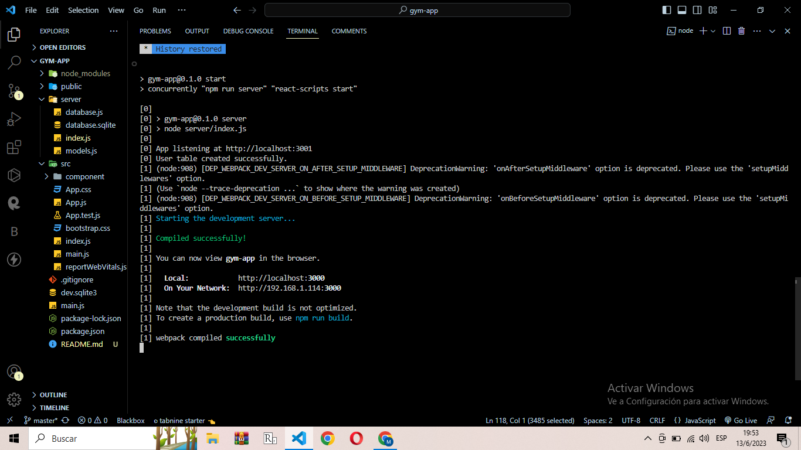

## 1 npm init --yes (para iniciar proyecto)
## 2 npm install (instalacion de dependencias)
## 3 npm start (corres el proyecto en http://localhost:3000)

## 4 npm run electron-start (corres electron)